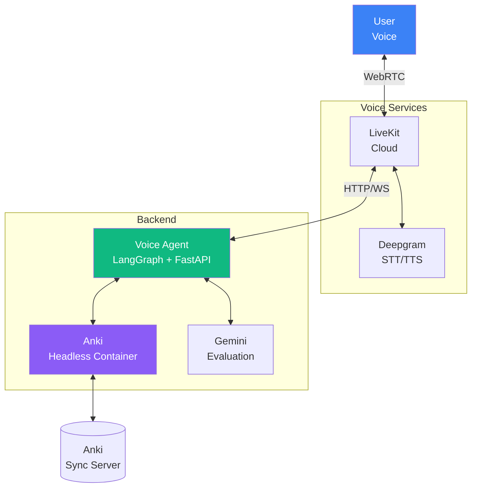
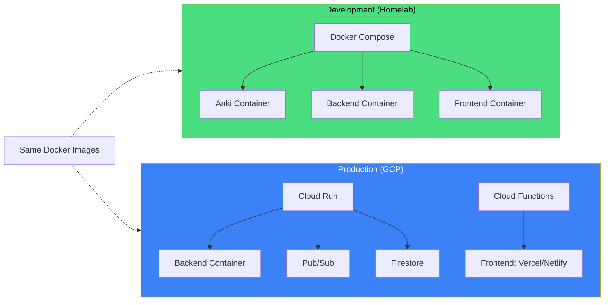
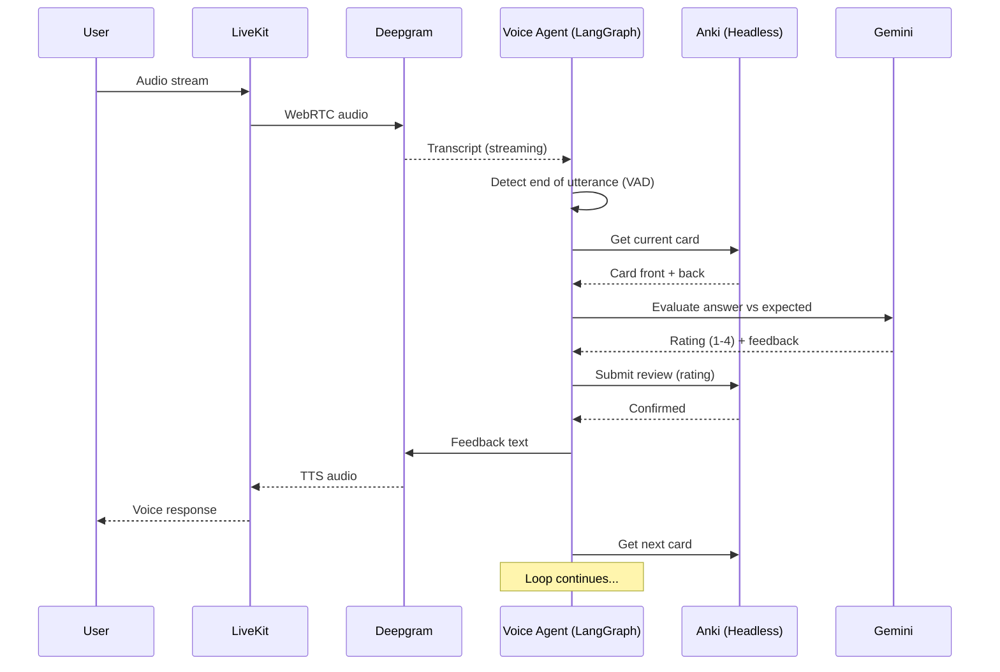
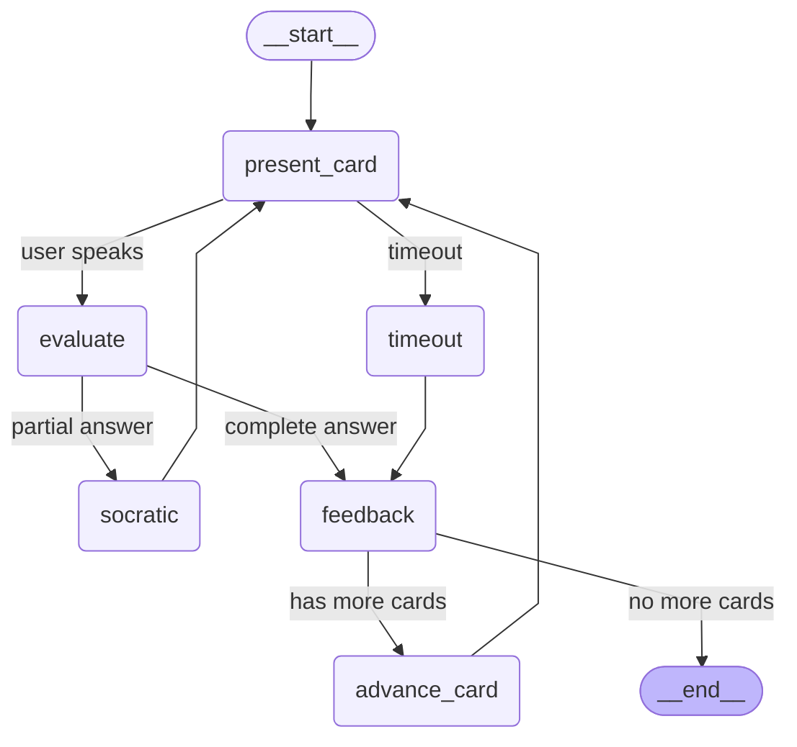
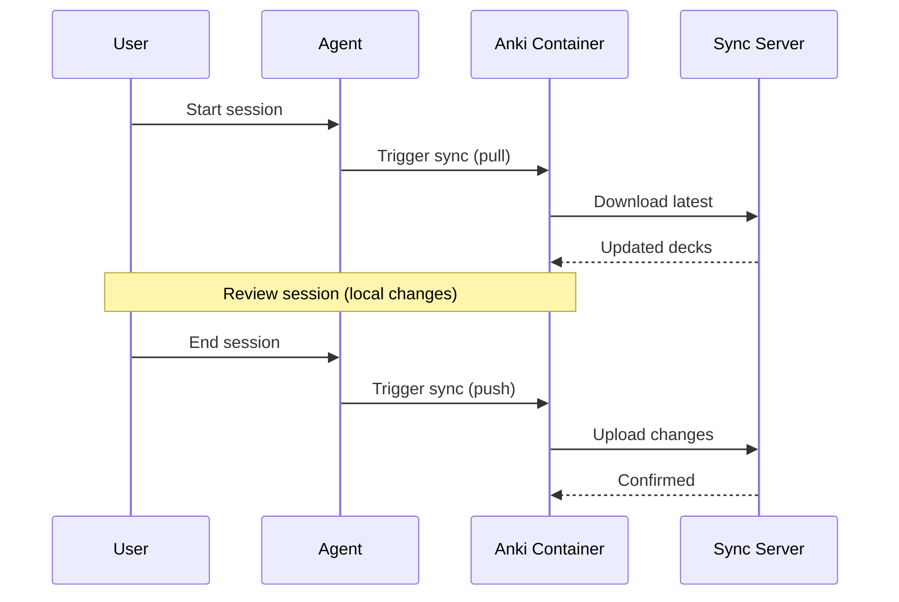
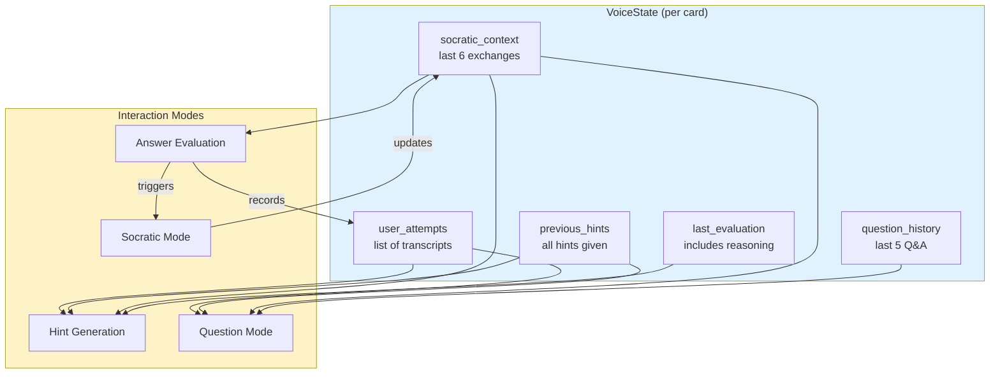

# Architecture Overview

> System design and component documentation for UNCONS.

## Executive Summary

UNCONS is a **voice-first AI tutor** built on Anki flashcards. Users speak their answers, and the system evaluates responses using LLM analysis, then submits ratings to Anki's spaced repetition scheduler.

**Key Architectural Principles:**
- **Hexagonal Architecture**: Business logic decoupled from infrastructure
- **Low-Latency**: Sub-1-second end-to-end response target
- **Anki Integration**: Headless deployment with sync server
- **Observable**: Distributed tracing via OpenTelemetry

---

## High-Level Architecture



---

## Component Overview

### Voice Layer (LiveKit Agents Framework)

| Component | Technology | Purpose |
|:---|:---|:---|
| **Framework** | LiveKit Agents v1.0+ | Unified voice pipeline orchestration |
| **WebRTC** | LiveKit Cloud | Real-time bidirectional audio |
| **STT** | Deepgram Nova-2 | Speech-to-text (streaming, < 150ms) |
| **TTS** | Cartesia Sonic / Deepgram Aura | Text-to-speech (< 100ms TTFA) |
| **VAD** | Silero VAD (via plugin) | Voice activity + semantic turn detection |

### Application Layer (Hybrid Architecture)

| Component | Technology | Purpose |
|:---|:---|:---|
| **Voice Pipeline** | LiveKit Agents | VAD, STT, TTS, barge-in handling |
| **Orchestration Brain** | LangGraph | State machine, branching, checkpointing |
| **API Framework** | FastAPI | HTTP/WebSocket endpoints |
| **LLM Evaluation** | Gemini 3 Flash | Answer comparison, rating assignment |

### Anki Layer

| Component | Technology | Purpose |
|:---|:---|:---|
| **Anki Runtime** | Headless Docker (Xvfb) | Run Anki without display |
| **API Interface** | AnkiConnect | REST API to Anki (port 8765) |
| **Sync Server** | anki-sync-server (Rust) | Self-hosted deck synchronization |

### Infrastructure Layer

| Component | Technology | Purpose |
|:---|:---|:---|
| **Containers** | Docker / Docker Compose | Service orchestration |
| **Observability** | OpenTelemetry | Distributed tracing, metrics |
| **Hosting** | Homelab (dev) / GCP (prod) | Deployment target |

### Cloud Services (GCP Option)

| Service | Purpose |
|:---|:---|
| **Cloud Run** | Backend API deployment |
| **Pub/Sub** | Async session events, sync triggers |
| **Firestore** | Session state, user preferences |
| **Artifact Registry** | Container images |
| **Secret Manager** | API keys (Deepgram, Gemini) |

---

## Deployment Strategy

### Two Environments, Same Code



### Environment Abstraction

**Adapters switch based on environment variables:**

```python
# adapters/session_store.py
def create_session_store() -> SessionStore:
    if os.getenv("ENV") == "production":
        return FirestoreAdapter()  # GCP Firestore
    else:
        return LocalFileAdapter()  # Homelab: JSON files

# adapters/event_publisher.py
def create_event_publisher() -> EventPublisher:
    if os.getenv("ENV") == "production":
        return PubSubAdapter()     # GCP Pub/Sub
    else:
        return LocalQueueAdapter() # Homelab: in-memory queue
```

### Deployment Workflow

```bash
# Development (Phases 0-4)
docker-compose up -d
# Code, test, iterate locally

# Production (Phase 5)
docker build -t uncons-backend .
docker tag uncons-backend gcr.io/PROJECT/uncons-backend
docker push gcr.io/PROJECT/uncons-backend
terraform apply  # Deploy to GCP
```

### Why This Works

| Benefit | How |
|:---|:---|
| **Portability** | Docker containers run anywhere |
| **Zero dev cost** | Homelab is free |
| **Portfolio-ready** | GCP deployment shows cloud skills |
| **No code changes** | Same image, different config |
| **Fast iteration** | Local dev is faster than cloud |

---

## Hexagonal Architecture + DDD

```
┌─────────────────────────────────────────────────────────────┐
│                        ADAPTERS (Outer)                      │
│  ┌──────────┐ ┌──────────┐ ┌──────────┐ ┌──────────┐        │
│  │ FastAPI  │ │AnkiConnect│ │  Gemini  │ │ Deepgram │        │
│  │ (HTTP)   │ │  (Anki)  │ │  (LLM)   │ │ (Voice)  │        │
│  └────┬─────┘ └────┬─────┘ └────┬─────┘ └────┬─────┘        │
│       │            │            │            │               │
│       │       ┌────────────┐ ┌──────────┐                   │
│       │       │ Pub/Sub    │ │ Firestore│                   │
│       │       │ (Events)   │ │ (State)  │                   │
│       │       └────┬───────┘ └────┬─────┘                   │
│       │            │            │                            │
│  ┌────▼────────────▼────────────▼────────────▼─────┐        │
│  │                    PORTS (Interface)             │        │
│  │  FlashcardService │ LLM │ Speech │ EventPublisher│        │
│  │  SessionStore                                    │        │
│  └────────────────────────┬────────────────────────┘        │
│                           │                                  │
│  ┌────────────────────────▼────────────────────────┐        │
│  │                  DOMAIN (Core - DDD)             │        │
│  │                                                  │        │
│  │   Entities: Session, Card                        │        │
│  │   Value Objects: Rating, EvaluationResult,       │        │
│  │                  SessionState, DeckStats         │        │
│  │   Services: EvaluationService, HintService,      │        │
│  │             SessionManager, CommandParser        │        │
│  │                                                  │        │
│  └──────────────────────────────────────────────────┘        │
└─────────────────────────────────────────────────────────────┘
```

### Domain Layer (DDD)

```python
# domain/value_objects/rating.py
class Rating(IntEnum):
    """Anki rating values (SM-2 ease buttons)."""
    AGAIN = 1  # Failed recall
    HARD = 2   # Recalled with difficulty
    GOOD = 3   # Normal recall
    EASY = 4   # Perfect recall

    @classmethod
    def from_evaluation(cls, confidence: float, partial: bool = False) -> "Rating":
        if confidence < 0.3: return cls.AGAIN
        elif confidence < 0.6 or partial: return cls.HARD
        elif confidence < 0.9: return cls.GOOD
        else: return cls.EASY

# domain/entities/session.py
@dataclass
class Session:
    """Review session entity - manages card queue and rating accumulation."""
    id: str
    deck_name: str
    state: SessionState
    cards: list[Card]
    current_index: int
    pending_ratings: list[PendingRating]  # Batch sync at end
    started_at: datetime
    last_activity: datetime
```

### Ports (Interfaces)

```python
# ports/flashcard_service.py
class FlashcardService(Protocol):
    async def get_decks(self) -> list[str]: ...
    async def get_reviewable_cards(self, deck_name: str) -> list[Card]: ...
    async def submit_review(self, card_id: int, rating: Rating) -> None: ...
    async def get_decks_with_card_counts(self) -> list[DeckStats]: ...
    async def sync(self) -> bool: ...

# ports/llm_service.py
class LLMPort(Protocol):
    async def evaluate_answer(self, request: EvaluationRequest) -> EvaluationResponse: ...
    async def generate_hint(self, request: HintRequest) -> HintResponse: ...

# EvaluationRequest includes: question, expected_answer, transcript,
#   response_time_seconds, hints_used, socratic_context
# EvaluationResponse includes: reasoning, is_semantically_correct,
#   fluency_score, rating, feedback, enter_socratic_mode, answer_summary

# ports/speech.py
class SpeechToText(Protocol):
    async def transcribe(self, audio_stream: AsyncIterator[bytes]) -> AsyncIterator[str]: ...

class TextToSpeech(Protocol):
    async def synthesize(self, text: str) -> AsyncIterator[bytes]: ...
```

> **Note**: `EventPublisher` and `SessionStore` ports are designed for GCP production but not yet implemented. Current MVP uses session-based sync and local state.

### Adapters (Implementations)

| Port | Adapter | Backed By | Status |
|:---|:---|:---|:---|
| `FlashcardService` | `anki_connect.py` | Headless Anki + AnkiConnect | Implemented |
| `LLMPort` | `gemini_adapter.py` | Gemini 3 Flash | Implemented |
| `SpeechToText` | `deepgram_stt.py` | Deepgram Nova-2 | Implemented |
| `TextToSpeech` | `deepgram_tts.py` | Deepgram Aura | Implemented |
| `EventPublisher` | `PubSubAdapter` | GCP Pub/Sub | Future (GCP) |
| `SessionStore` | `FirestoreAdapter` | GCP Firestore | Future (GCP) |

---

## Data Flow: Voice Review Session



---

## Hybrid Architecture: LiveKit Agents + LangGraph

We use a **hybrid architecture** where each framework handles what it does best:

```
┌─────────────────────────────────────────────────────────────┐
│                     LIVEKIT AGENTS                          │
│        (Audio transport, VAD, STT, TTS, barge-in)          │
├─────────────────────────────────────────────────────────────┤
│                                                             │
│   User speaks → STT → ┌───────────────────────────────┐    │
│                       │         LANGGRAPH             │    │
│                       │    (Orchestration brain)      │    │
│                       │                               │    │
│                       │  ┌───────┐    ┌───────────┐  │    │
│                       │  │ Eval  │───→│ Socratic  │  │    │
│                       │  └───┬───┘    └─────┬─────┘  │    │
│                       │      │              │        │    │
│                       │      ▼              ▼        │    │
│                       │  ┌───────────────────────┐   │    │
│                       │  │      Feedback         │   │    │
│                       │  └───────────┬───────────┘   │    │
│                       │              │               │    │
│                       │   Checkpointing, Undo, State │    │
│                       └──────────────┼───────────────┘    │
│                                      ▼                     │
│                         TTS ← response text                │
└─────────────────────────────────────────────────────────────┘
```

### Responsibility Split

| Capability | LiveKit Agents | LangGraph |
|:-----------|:---------------|:----------|
| Audio transport (WebRTC) | Yes | No |
| VAD, STT, TTS, Barge-in | Yes | No |
| Simple function tools | Yes | Yes |
| **Conditional branching** | Limited | Yes |
| **Session persistence** | Limited | Yes |
| **Undo/rollback** | No | Yes |
| **Socratic mode loop** | Limited | Yes |

---

## LangGraph State Machine



> **Note**: The "listening" state is handled by the LiveKit agent, not within the LangGraph state machine. Hints are also handled outside this graph by `HintService` called from `worker.py`.

### State Schema

```python
class VoiceState(TypedDict, total=False):
    """LangGraph state schema for voice session (checkpointed to SQLite)."""
    # Session info
    session_id: str
    deck_name: str

    # Card state
    current_card: CardDict | None
    previous_card: CardDict | None  # For undo
    card_queue: list[CardDict]

    # Evaluation
    last_transcript: str | None
    last_evaluation: EvaluationDict | None

    # Socratic mode
    socratic_turn_count: int
    socratic_context: list[str]  # Sliding window (last 3 turns)

    # Hints
    hints_used: int
    previous_hints: list[str]  # Context for LLM

    # Question mode (follow-up Qs after reveal)
    question_history: list[dict[str, str]]  # [{"q": "...", "a": "..."}]

    # Flow control
    current_state: Literal["idle", "presenting", "listening",
                          "evaluating", "feedback", "socratic", "ended"]
    should_end: bool

    # Metrics
    cards_reviewed: int
    rating_history: list[int]

    # Error tracking (resilience)
    last_error: str | None
    retry_count: int
    consecutive_timeouts: int
```

### Edge Case Handling

| User Says | System Response | Rating |
|:---|:---|:---:|
| "I don't know" | "No problem. The answer is {back}. Let's move on." | 1 (Again) |
| "Give me a hint" | Provides partial hint, continues waiting | Caps at 2 (Hard) |
| "Skip" / "Bury" | Skips card, no rating submitted | None |
| "Go back" / "Undo" | Reverts last review, re-presents card | Removes last |
| "Repeat" / "Say again" | Re-reads the card question | No change |
| "Stop" / "End session" | Syncs to Anki, ends session | — |
| *Wrong language* | "I heard {transcript}. Please answer in {expected_language}." | 1 (Again) |
| *Empty/gibberish* | "I didn't catch that. Could you repeat?" (max 3 retries) | — |

### Error Recovery

| Error Type | Detection | Recovery Action |
|:---|:---|:---|
| **STT timeout** | No transcript after 10s | "I'm having trouble hearing you. Try again?" |
| **LLM failure** | API error or malformed response | Retry once, then ask user to self-rate |
| **LLM hallucination** | Rating outside 1-4 | Clamp to valid range, log for review |
| **AnkiConnect error** | Submit fails | Queue locally, retry on next card |
| **Network drop mid-utterance** | WebRTC disconnect | Buffer audio, resume when reconnected |
| **Max retries exceeded** | 3 failed STT attempts | Auto-skip card, notify user |

---

## Anki Integration Architecture

### Headless Anki Container

```
┌─────────────────────────────────────────┐
│           Docker Container              │
│  ┌─────────────────────────────────┐   │
│  │         Xvfb (Virtual Display)   │   │
│  │  ┌───────────────────────────┐  │   │
│  │  │      Anki Desktop         │  │   │
│  │  │  ┌─────────────────────┐  │  │   │
│  │  │  │   AnkiConnect       │  │  │   │
│  │  │  │   (Port 8765)       │  │  │   │
│  │  │  └─────────────────────┘  │  │   │
│  │  └───────────────────────────┘  │   │
│  └─────────────────────────────────┘   │
│                                         │
│  Volume: /data/anki-profile             │
└─────────────────────────────────────────┘
```

### Sync Strategy

**Session-based sync** (due to SQLite limitations):



---

## Latency Budget

| Stage | Target | Notes |
|:---|:---:|:---|
| Audio capture → STT start | < 100ms | WebRTC + LiveKit |
| STT transcription | < 150ms | Deepgram streaming |
| LLM Evaluation | < 500ms | Gemini 3 Flash |
| AnkiConnect call | < 50ms | Local container |
| TTS synthesis | < 200ms | Deepgram Aura |
| **Total End-to-End** | **< 1 second** | User speaks → hears response |

---

## Noise Handling (Outdoor Use)

The architecture includes robust noise handling for walking/outdoor reviews:

### Signal Processing Pipeline

```
Microphone → HPF (150Hz) → AGC → Silero VAD → WebRTC Stream
                                     ↓
                            [Circular Buffer 400ms]
                                     ↓
                              Deepgram STT
```

### Key Techniques

| Technique | Purpose |
|:---|:---|
| **High-Pass Filter (150Hz)** | Remove wind rumble |
| **Silero VAD (threshold 0.9)** | Neural speech detection |
| **Circular Buffer (400ms)** | Capture initial phonemes |
| **utterance_end_ms** | Detect speech end in noise |

---

## Platform Strategy

### Web First, Capacitor If Needed

**Primary Focus:** Standard web application that works across all platforms in foreground.

```
Browser → WebRTC → LiveKit → Backend
```

**Platform Support:**

| Platform | Foreground | Background | Notes |
|:---|:---:|:---:|:---|
| PC Browser | Yes | N/A | Primary dev/demo platform |
| Android Browser/PWA | Yes | Limited | Works for walking use |
| iOS Safari | Yes | No | Mic killed on screen lock |

**Why Web First:**
- Single codebase for all platforms
- No app store approval needed
- Instant updates
- PWA adds home screen install
- Capacitor can wrap later if needed (95% code reuse)

**Future: Capacitor Wrapper**
Only if users demand iOS background audio. The web app architecture is Capacitor-ready.

---

## Security Considerations

### API Security

| Concern | Mitigation |
|:---|:---|
| **AnkiConnect exposure** | Bind to localhost only (127.0.0.1:8765), never expose to network |
| **API key exposure** | Store in environment variables, never commit to repo |
| **Frontend secrets** | Use backend proxy for all API calls, no keys in browser |
| **CORS policy** | Restrict to known origins only |

### Data Privacy

| Principle | Implementation |
|:---|:---|
| **No audio storage** | Streaming pipeline only, audio not persisted |
| **Minimal data retention** | Session state cleared after sync |
| **User owns data** | All flashcard data stays in user's Anki account |
| **Audit logging** | Log events (not content) for debugging |

### Rate Limiting

| Endpoint | Limit | Purpose |
|:---|:---|:---|
| Demo mode | 10 cards/session, 3 sessions/hour | Prevent abuse |
| Authenticated | 100 cards/session | Fair usage |
| API calls | 60/minute per user | Cost protection |

---

## Infrastructure Layer

### Usage Tracking

All billable services are tracked for cost monitoring:

```python
# infrastructure/usage_tracker.py
ServiceType = Enum("ServiceType", [
    "GEMINI", "DEEPGRAM_STT", "DEEPGRAM_TTS",
    "CARTESIA_TTS", "LIVEKIT_SESSION"
])

# Cost calculation per service
log_gemini_usage(input_tokens, output_tokens)  # Per-token pricing
log_deepgram_stt_usage(duration_seconds)       # $0.0043/minute
log_deepgram_tts_usage(characters)             # $0.015/1k chars
log_livekit_session_usage(duration_seconds)    # $0.0035/participant-minute

# Usage logged to backend/logs/usage.jsonl
get_usage_summary(since_date)  # Aggregates by service
```

### Recovery Store

Session state persisted for crash recovery:

```python
# infrastructure/recovery_store.py
class RecoveryStore:
    async def save_session(self, session_id: str, state: dict) -> None: ...
    async def get_session(self, session_id: str) -> dict | None: ...
    async def delete_session(self, session_id: str) -> None: ...
```

### Hint Service

LLM-generated pedagogical hints that guide without revealing:

| Level | Type | Description |
|:---:|:---|:---|
| 0 | Contextual | Topic area, related concepts |
| 1 | Structural | First letter, word count, format |
| 2+ | Reveal | Brief insight (not verbatim answer) |

```python
# domain/services/hint_service.py
class HintService:
    async def generate_hint(
        self, question: str, answer: str,
        hint_level: int, previous_hints: list[str]
    ) -> str: ...
```

---

## Conversation Context Architecture

The system maintains unified conversation context that flows across all interaction modes:

### Context Flow Diagram



### Context by Mode

| Mode | Receives | Records |
|:-----|:---------|:--------|
| **Evaluation** | transcript, socratic_context | user_attempts, last_evaluation |
| **Hint Generation** | user_attempts, previous_hints, socratic_context, evaluation_gap | previous_hints |
| **Question Mode** | user_attempts, previous_hints, socratic_context, question_history | question_history |
| **Socratic Mode** | socratic_context (6 entries max) | socratic_context |

### Context Lifecycle

- **Per-Card**: All context resets when advancing to next card
- **Sliding Windows**: socratic_context (6 entries), question_history (5 entries), user_attempts (3 entries)
- **Checkpointed**: State persisted to SQLite for crash recovery

---

*Last updated: 2026-01-11*
