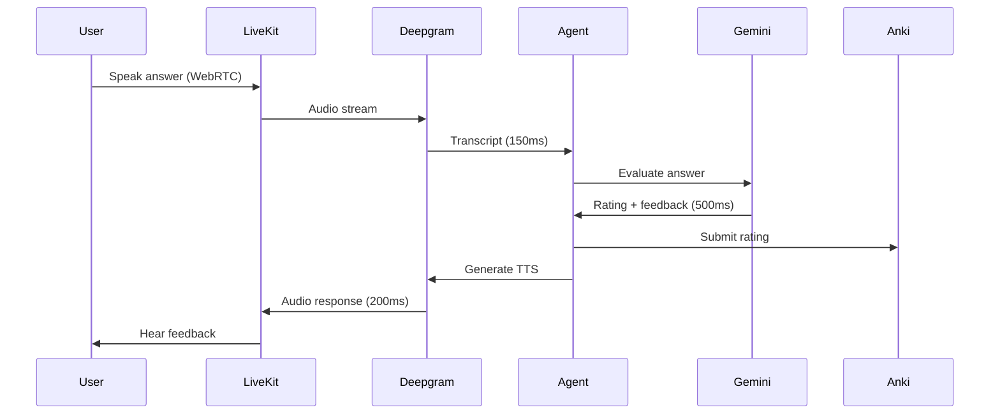

<!-- Status badges -->


# UNCONS: Voice-First AI Flashcard Tutor

> A voice-first AI tutor that transforms Anki flashcard reviews into spoken conversations

## The Problem

Traditional flashcard review is a **silent, mechanical process**. You read a question, think of an answer, flip the card, and click a rating button. This approach has four significant limitations:

1. **Passive engagement** - Mental recall without verbalization leads to weaker memory encoding
2. **Context switching** - Can't review while walking, commuting, or exercising
3. **Binary grading is dishonest** - Traditional flashcards force you to choose "knew it" or "didn't." But what about partial knowledge? Hesitation? Needing a hint? These nuances matter for optimal scheduling.
4. **No guidance when stuck** - When you're blanking on an answer, traditional apps just reveal it. No Socratic prompting to help you work through it. No hints. No explanation of *why* it matters.

For IT professionals, finding dedicated "screen time" for flashcards competes with work and life.

## The Solution

**UNCONS** transforms flashcard review into an intelligent, voice-first conversation:

### Voice + Text Mode Flexibility

Review cards however fits your context:
- **Voice mode**: Push-to-talk with sub-150ms speech-to-text (Deepgram)
- **Text mode**: Type answers when voice isn't practical (commute, library)
- Same semantic evaluation for both modes

### Honest Rating (Two-Dimensional Grading)

The AI separates *what you know* from *how you said it*:

| Dimension | What It Measures | Example |
|-----------|-----------------|---------|
| **Semantic correctness** | Did you understand the concept? | "freezing" accepted for "cold" |
| **Fluency** | How confidently did you recall it? | Hesitation, filler words, self-corrections |

Additional smarts:
- **ASR error correction**: "pears" → "Paris" (phonetic similarity detected)
- **Synonym acceptance**: Alternative terminology counts as correct
- **Hints cap rating**: If you needed help, rating capped at Hard (2)
- **Conservative bias**: Ties broken toward lower rating (honest scheduling)

### Socratic Mode (Guided Follow-up Questions)

When you give a *partial* answer, the AI doesn't just mark you wrong:

```
AI: "What makes TCP reliable?"
User: "It's a protocol for sending data"
AI: "You mentioned it's a protocol. What mechanism does TCP use
     to ensure packets actually arrive?"
User: "Acknowledgments?"
AI: "Exactly! TCP uses acknowledgments to confirm delivery."
```

- Triggers only on partial knowledge (not complete blanks)
- Max 2 guided exchanges before revealing
- Helps you fill in gaps through your own reasoning

### Progressive Hints System

When you're stuck, ask for hints that guide without revealing:

| Level | Type       | Example                                          |
| ----- | ---------- | ------------------------------------------------ |
| 0     | Contextual | "Think about networking protocols..."            |
| 1     | Deeper     | "What's the core tension this pattern resolves?" |
| 2+    | Reveal     | Shows answer with a brief "aha moment" insight   |

Hints are **context-aware**: the AI knows what you already attempted.

### Mnemonic Generation

After seeing an answer, request a memory aid:
- **Acronyms**: First letters of key terms
- **Vivid images**: Mental pictures that stick
- **Rhymes**: Rhythm-based recall
- **Analogies**: Connections to everyday concepts

### Question Mode (Post-Reveal Learning)

After revealing the answer, keep learning:

```
AI: "The answer is: Transmission Control Protocol"
User: "Why does that matter?"
AI: "TCP's reliability guarantees are why web pages load completely
     instead of showing partial content. Without it, streaming video
     would be unwatchable."
```

- Ask "Explain more" or "Give me an example"
- AI explains *why* the answer matters, not just *what* it is
- Full context of your struggle passed to the LLM

---

**Under the hood:**
- **Deepgram** for real-time speech-to-text (< 150ms latency)
- **Gemini 3 Flash** for semantic evaluation (< 500ms)
- **LiveKit** for WebRTC voice streaming
- **Anki sync** for spaced repetition scheduling

All within a **sub-1-second response time** that feels conversational.

---

## Technical Highlights

### Architecture: Hexagonal Design with DDD

UNCONS uses a hexagonal (ports & adapters) architecture combined with Domain-Driven Design principles:

```
backend/src/
├── domain/           # Pure business logic (NO external dependencies)
│   ├── entities/     # Session, Card
│   ├── value_objects/# Rating, EvaluationResult, SessionState
│   └── services/     # EvaluationService, SessionManager, GradingService
├── ports/            # Abstract interfaces (Protocols)
└── adapters/         # Concrete implementations (Gemini, Deepgram, AnkiConnect)
```

**Why this matters:**
- The domain logic is completely testable without external services
- Adapters can be swapped (e.g., Whisper instead of Deepgram) without touching business logic
- The architecture documents itself through clear boundaries

**Key file:** `backend/src/agents/voice_orchestrator.py` - A LangGraph state machine with 7 states managing the entire conversation flow.

### Real-Time Voice Pipeline

The voice system uses **LiveKit Agents** with Deepgram for STT/TTS:



**Latency achieved:** ~850ms total round-trip (target was < 1 second)

### Intelligent Hints System

LLM-generated pedagogical hints guide learning without revealing answers:

| Level | Type | Description |
|-------|------|-------------|
| 0 | Contextual | Topic area, related concepts |
| 1 | Structural | First letter, word count, format |
| 2+ | Reveal | Brief insight (not verbatim answer) |

When a user requests a hint, the system provides progressively more helpful guidance. "Give up" reveals the answer with a brief "aha moment" insight rather than reading the full answer verbatim.

**Key file:** `backend/src/domain/services/hint_service.py`

### Testing Strategy

The project has **576+ tests** organized in a testing pyramid:

| Layer | Count | Purpose |
|-------|-------|---------|
| Unit tests | ~374 | Domain logic, services |
| Fast integration | 48 | Adapters with mocks |
| E2E (Backend) | 17 | Backend user flows |
| E2E (Playwright) | 121 | Full user flows |

E2E tests achieve **100% pass rate** after extensive stabilization work.

---

## Challenges Solved

### 1. Voice Latency Optimization

**Problem:** Initial voice spike showed 800ms+ STT latency, exceeding our 600ms target.

**Solution:**
- Switched from batch processing to streaming transcription
- Prewarmed VAD model to eliminate cold-start penalty (200-500ms savings)
- Used Deepgram's `utterance_end_ms` for faster turn detection

**Result:** 3-500ms STT latency, well under target.

### 2. LiveKit Agents Event Reliability

**Problem:** The `conversation_item_added` event was unreliable, causing missed card presentations.

**Solution:**
- Used `speech_created` event instead (more reliable)
- Implemented pre-send via data channel for guaranteed delivery
- Added fallback polling for critical state

### 3. E2E Test Stabilization

**Problem:** E2E tests had 55% pass rate due to timing issues with async voice sessions.

**Solution:**
- Implemented proper WebSocket wait patterns
- Added `textModeOnly` parameter for deterministic testing
- Created robust selectors with `data-testid` attributes

**Result:** 100% E2E pass rate.

---

## Skills Demonstrated

| Skill | Evidence |
|-------|----------|
| **Python async programming** | All adapters use `asyncio`, `httpx` |
| **FastAPI** | 13 API endpoints with dependency injection |
| **LangGraph** | 7-state voice orchestrator |
| **LiveKit/WebRTC** | Real-time voice streaming |
| **Deepgram STT/TTS** | Streaming speech pipeline |
| **Hexagonal architecture** | Clean ports/adapters separation |
| **Domain-Driven Design** | Entities, value objects, domain services |
| **Playwright E2E** | 100% pass rate, 5 test suites |
| **Next.js 14** | React frontend with App Router |

---

## Documentation

For detailed technical documentation, see:

- **[ARCHITECTURE.md](ARCHITECTURE.md)** - System design, component overview, hexagonal architecture, data flow diagrams
- **[VOICE_ORCHESTRATION.md](VOICE_ORCHESTRATION.md)** - LangGraph state machine, node functions, transition logic, error handling

---

## Quick Start

### Prerequisites

- Python 3.11+
- Node.js 20+
- Poetry (Python package manager)
- API keys: LiveKit, Deepgram, Cartesia, Google Gemini

### Setup

1. **Clone and install:**

```bash
git clone https://github.com/lisardo-iniesta/uncons-demo.git
cd uncons-demo

# Backend
cd backend && poetry install && cd ..

# Frontend
cd frontend && npm install && cd ..
```

2. **Configure environment:**

```bash
cp .env.example .env
# Edit .env with your API keys

cp .env frontend/.env.local
```

3. **Start (3 terminals):**

```bash
# Terminal 1: Backend API
cd backend
poetry run uvicorn src.app:app --reload --host 0.0.0.0 --port 8000

# Terminal 2: LiveKit Agent Worker
cd backend
poetry run python src/agents/worker.py dev

# Terminal 3: Frontend
cd frontend
npm run dev
```

4. **Open:** http://localhost:3000

### Test Decks (20 cards)

- **Fundamentals::04 SE Python** - SOLID principles, DI, context managers
- **Fundamentals::05 Async Python** - Event loops, coroutines, asyncio

---

## Contact

**Lisardo Iniesta**

Built with Python, FastAPI, LangGraph, LiveKit, Deepgram, Gemini 3 Flash, Next.js, and Tailwind CSS.

---

*Last updated: 2026-01-11*
