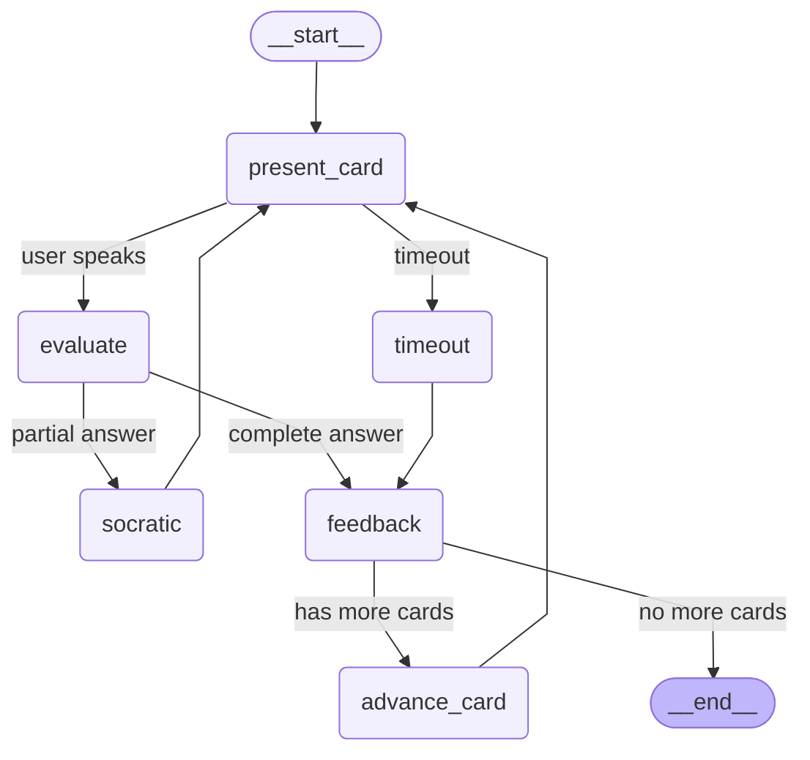
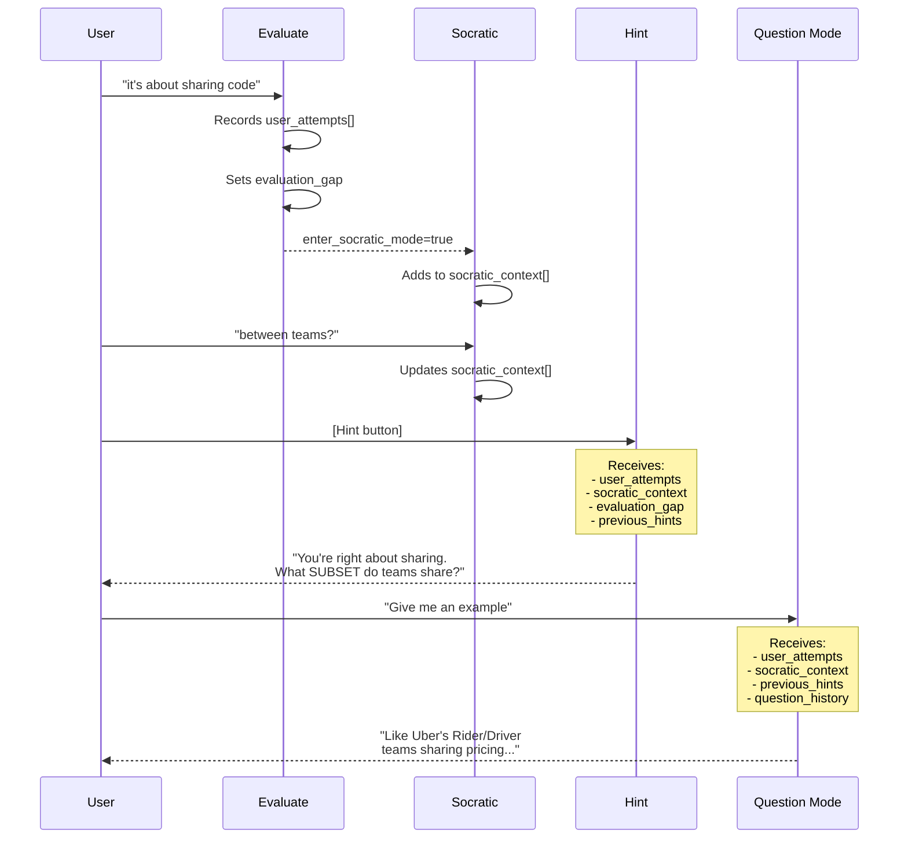

# Voice Orchestration Flow

This document describes the voice interaction state machine implemented with LangGraph.

## Architecture Overview

The voice session is managed by two components:

1. **VoiceOrchestrator** (`backend/src/agents/voice_orchestrator.py`) - LangGraph state machine for card flow and evaluation
2. **UnconsAgent** (`backend/src/agents/uncons_agent.py`) - LiveKit agent handling audio I/O, TTS/STT, and real-time interaction

The LangGraph orchestrator manages the **business logic** (card progression, evaluation, scoring), while the LiveKit agent handles **real-time interaction** (listening, speaking, interruption).

## LangGraph State Machine



> **Note**: The "listening" state is handled by the LiveKit agent, not within the LangGraph state machine. Hints are also handled outside this graph by `HintService` called from `worker.py`.

## Node Functions

| Node | Function | Purpose |
|------|----------|---------|
| `present_card` | `present_card_node()` | Presents card question, sets state to listening |
| `evaluate` | `evaluate_node()` | Evaluates user answer via EvaluationService (has retry policy) |
| `socratic` | `socratic_node()` | Handles guided questioning (max 2 turns) |
| `feedback` | `feedback_node()` | Records rating, stores previous card for undo |
| `advance_card` | `advance_card_node()` | Moves to next card in queue |
| `timeout` | `timeout_node()` | Handles timeout as "don't know" (Rating 1) |

**Not in graph but available:**
| Function | Purpose |
|----------|---------|
| `handle_command_node()` | Handles SKIP, REPEAT, HINT, UNDO, STOP commands |

## States Explained

These are the values in `VoiceSessionState` enum:

| State | Description | User Can... |
|-------|-------------|-------------|
| `idle` | Session not started | Start session |
| `presenting` | Card question being read | Wait for question to finish |
| `listening` | Waiting for user answer (handled by LiveKit) | Speak, stay silent, use commands |
| `evaluating` | Processing answer via LLM | Wait |
| `feedback` | Delivering result | Request undo |
| `socratic` | Guided questioning mode (max 2 turns) | Answer follow-up questions |
| `ended` | Session complete | Start new session |

> **Note**: Hints don't have a dedicated state. They're handled by `worker.py` calling `HintService` and returning to `listening` state.

## Conversation Context Flow

Context flows between modes to enable personalized responses:



### Context Fields in VoiceState

| Field | Type | Purpose | Flows To |
|:------|:-----|:--------|:---------|
| `user_attempts` | `list[str]` | User's answer transcripts (last 3) | Hints, Questions |
| `previous_hints` | `list[str]` | All hints given this card | Hints, Questions |
| `socratic_context` | `list[str]` | Socratic exchanges (last 6) | Evaluation, Hints, Questions |
| `question_history` | `list[dict]` | Q&A exchanges (last 5) | Questions |
| `last_evaluation.reasoning` | `str` | Why answer was wrong | Hints (as evaluation_gap) |

## Transition Logic

### From `evaluate`
```python
def route_from_evaluate(state):
    if state["last_evaluation"]["enter_socratic_mode"]:
        return "socratic"  # Partial answer - ask follow-up
    return "feedback"       # Complete answer - give feedback
```

### From `feedback`
```python
def route_from_feedback(state):
    if state["card_queue"]:
        return "next_card"  # More cards
    return "end"            # Session complete
```

### Timeout Handling
- Base timeout: 30 seconds
- Extended timeout: 60 seconds (if filler words detected or in socratic mode)
- After MAX_CONSECUTIVE_TIMEOUTS (3), session ends gracefully

## Error Handling & Recovery

### Retry Policy
The `evaluate` node has a retry policy for transient LLM failures:
- Max attempts: 2
- Retries on: Network errors, rate limits (5xx status codes)

### Consecutive Timeout Protection
Prevents infinite timeout loops:
```python
MAX_CONSECUTIVE_TIMEOUTS = 3

# After 3 consecutive timeouts, session ends gracefully
if consecutive_timeouts >= MAX_CONSECUTIVE_TIMEOUTS:
    return {"should_end": True, "current_state": "ended"}
```

### Error State Tracking
The state schema includes error tracking fields:
- `last_error`: Description of last error (if any)
- `retry_count`: Number of retries in current node
- `consecutive_timeouts`: Count of consecutive timeout events

## Thresholds

From `domain/constants.py`:

| Constant | Value | Action |
|----------|-------|--------|
| `SILENCE_UTTERANCE_END_MS` | 300ms | Mark speech complete |
| `SILENCE_THINKING_MS` | 2000ms | Wait (user may be thinking) |
| `SILENCE_TIMEOUT_MS` | 30000ms | Base timeout - treat as "don't know" |
| `SILENCE_EXTENDED_TIMEOUT_MS` | 60000ms | Extended timeout (filler words or socratic) |
| `CONFIDENCE_CLARIFY_THRESHOLD` | 0.7 | Below this, ask to repeat |
| `MAX_SOCRATIC_TURNS` | 2 | Max guided questioning before answer |
| `MAX_SOCRATIC_CONTEXT_ENTRIES` | 6 | Sliding window for context (3 exchanges) |
| `MAX_CONSECUTIVE_TIMEOUTS` | 3 | End session after this many timeouts |

**Hint Levels** (handled by `HintService`, not in graph):

| Level | Type | Description |
|:---:|:---|:---|
| 0 | Contextual | Topic hints, related concepts |
| 1 | Structural | First letter, format clues |
| 2+ | Reveal | Brief insight, "Give Up" triggers this |

## Checkpointing

The orchestrator supports SQLite checkpointing for crash recovery:

```python
from langgraph.checkpoint.sqlite import SqliteSaver

checkpointer = SqliteSaver.from_conn_string("sessions.db")
compiled_graph = orchestrator.compile(checkpointer=checkpointer)
```

## Performance Budget

| Stage | Target | Red Flag |
|-------|--------|----------|
| STT | <150ms | >200ms |
| LLM (evaluate) | <500ms | >600ms |
| TTS | <200ms | >300ms |
| **Total** | **<1000ms** | **>1200ms** |

## VoiceOrchestrator Class

The `VoiceOrchestrator` class wraps the LangGraph and provides session management:

```python
class VoiceOrchestrator:
    # Session lifecycle
    def create_session(session_id, deck_name, cards) -> VoiceStateManager
    def has_active_session() -> bool
    def get_stats() -> dict

    # Card management
    def get_current_card() -> CardDict | None
    def get_previous_card() -> CardDict | None
    def advance_card() -> CardDict | None
    def can_undo() -> bool
    def undo_card() -> CardDict | None

    # Evaluation
    async def evaluate(state) -> dict  # Main evaluation entry point
    async def process_transcript(transcript, is_timeout) -> dict

    # Hints (state tracking only - actual hint generation via HintService)
    def increment_hints() -> int
    def get_hint_level() -> int
    def get_previous_hints() -> list[str]

    # Commands
    async def handle_command(command) -> dict

    # Question mode (follow-up Qs after reveal)
    def add_question_exchange(question, answer) -> None
    def get_question_history() -> list[dict]
```

---

*Last updated: 2026-01-11*
